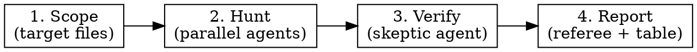

# Bug Hunter — Adversarial Code Defect Analysis

Multi-agent pipeline that finds, verifies, and reports real bugs in the
jetson-ffmpeg codebase. Adapted from the Hunter/Skeptic/Referee pattern
with domain-specific checklists for Tegra V4L2, DMA-BUF, and FFmpeg
codec wrappers.

## When to Use

- Proactive audit before a release or after large changes
- Investigating a crash, hang, or memory leak
- Reviewing new codec, filter, or API additions
- Post-merge regression check (`--scope` to limit blast radius)

## Pipeline



### Phase 1 — Scope

Determine target files. If user gave a path, use it. Otherwise select by
`--scope`:

| Scope | Files |
|-------|-------|
| `libnvmpi` | `src/*.cpp`, `include/*.h`, `include/*.hpp` |
| `ffmpeg` | `ffmpeg/dev/common/libavcodec/nvmpi_*.c` |
| `vic` | `ffmpeg/dev/common/libavfilter/vf_scale_vic.c`, `src/nvmpi_vic*.cpp` |
| `all` (default) | All of the above |

Skip: generated patches (`ffmpeg/patches/`), test scripts, build scripts,
stubs, documentation. Read test files for context only — never report bugs
in tests.

### Phase 2 — Hunt (parallel subagents)

Dispatch one **Hunter agent per layer** (model: `sonnet`). Each Hunter
reads its assigned files and applies the full checklist below. Hunters
work in isolation — no shared state.

**Prompt each Hunter with:**

```
You are a systems-level C/C++ bug hunter specialized in NVIDIA Jetson
media pipelines. Read every assigned file fully. For each file, apply
ALL checklist categories below. Report ONLY confirmed or high-confidence
findings — quality over quantity.

False positives cost credibility. A downstream Skeptic agent will
challenge every finding. Five real bugs beat twenty false positives.
```

**Hunter output format** (one JSON array per hunter):

```json
[
  {
    "id": "H1",
    "file": "src/nvmpi_dec_api.cpp",
    "line": 739,
    "category": "teardown-ordering",
    "severity": "HIGH",
    "summary": "pool_alive set after deinitFramePool — release callback race",
    "evidence": "L739 destroys buffers, L744 sets flag. Window exists.",
    "trigger": "Late frame unref on FFmpeg 8.1+ scheduler",
    "suggested_fix": "Move pool_alive->store(false) before deinitFramePool()"
  }
]
```

### Phase 3 — Verify (Skeptic agent)

Dispatch a single **Skeptic agent** (model: `sonnet`) that receives ALL
Hunter findings. For each finding, the Skeptic:

1. Reads the cited file and line range
2. Traces the actual control flow — does the bug exist?
3. Checks if a guard, caller convention, or upstream check prevents it
4. Checks if the finding was already fixed (git blame / recent commits)
5. Assigns verdict: `CONFIRMED`, `PLAUSIBLE`, or `FALSE_POSITIVE`

**Skeptic must reject** findings that:
- Cite dead code or unreachable paths
- Ignore an existing guard (NULL check, fd >= 0, atomic flag)
- Describe theoretical issues that can't be triggered by any caller
- Duplicate another finding (mark as `DUPLICATE of Hx`)

### Phase 4 — Report (orchestrator)

Collect Skeptic output. Drop `FALSE_POSITIVE` findings. Merge duplicates.
Sort by severity (Critical → High → Medium → Low → Info).

**Final output table:**

```
| # | File:Line | Category | Summary | Trigger | Severity | Verdict |
|---|-----------|----------|---------|---------|----------|---------|
```

After the table, list items confirmed **CLEAN** with one-line reasoning.
End with **fix recommendations** grouped by file.

Write report to `.work/bug-hunter-report-YYYY-MM-DD.md`.

---

## Checklist — What Hunters Must Check

### 1. Resource Lifecycle

| Check | What to look for |
|-------|-----------------|
| Alloc-dealloc pairing | Every `malloc/new/av_malloc/NvBufSurf::NvAllocate/av_frame_alloc/av_packet_alloc` has a guaranteed dealloc path |
| Error-path leaks | Every `return/goto/break` between alloc and dealloc frees everything allocated so far |
| Batch partial failure | Loop allocates N items, iteration K fails — are 0..K-1 cleaned up? |
| Pool/queue drain | Destructor or close drains both queues and frees each item? |
| fd lifecycle | Every opened fd closed on all paths? Set to -1 after close? Dup'd fds tracked? |
| Idempotency | Can cleanup be called twice safely? Guards on fd != -1, ptr != NULL? |
| Check-and-null | After free/delete/destroy: pointer set to NULL, fd set to -1? |

### 2. NULL Safety

| Check | What to look for |
|-------|-----------------|
| Alloc return check | `malloc/av_mallocz/av_frame_alloc/av_packet_alloc` return checked before deref? |
| Factory return check | `NvVideoDecoder::createVideoDecoder/createVideoEncoder` return checked? |
| API return check | `nvmpi_create_decoder/encoder` return checked by FFmpeg wrapper? |
| Post-move state | After `av_frame_move_ref`, source frame is empty — code must not use source's data pointers |

### 3. Threading & Concurrency

| Check | What to look for |
|-------|-----------------|
| Atomic flags | Flags shared between threads (`eos`, `flushing`, `capPlaneGotEOS`) must be `std::atomic<bool>` |
| Thread-before-resource | Threads joined/stopped before any resource they touch is destroyed? |
| Lock ordering | If multiple locks exist, is ordering documented and followed? |
| Race windows | Time-of-check-to-time-of-use between flag check and resource access? |
| Resolution-change safety | Resources held by user thread safe during capture-thread resolution change? |

### 4. V4L2 / Hardware Contracts

| Check | What to look for |
|-------|-----------------|
| STREAMOFF before dealloc | V4L2 buffers not freed while plane is streaming? |
| qBuffer/dqBuffer errors | Return values checked? Failed qBuffer means buffer lost from circulation |
| Buffer bounds | Data written to OUTPUT plane fits negotiated `v4l2_buffer.length`? |
| EOS propagation | EOS signal unblocks all waiters? No deadlock after EOS? |
| Resolution change | Old capture buffers fully torn down before new allocation? Dimensions reset? |
| TEST_ERROR macro | Does it return/abort, or just log? (known project pitfall) |

### 5. FFmpeg API Contracts

| Check | What to look for |
|-------|-----------------|
| Ref counting | `AVPacket/AVFrame` unref'd before reuse? Freed in close? |
| Init failure cleanup | Does `.close()` get called on `.init()` failure? `FF_CODEC_CAP_INIT_CLEANUP` set? |
| Extradata ownership | `avctx->extradata` allocated in init, freed in close? Freed on init failure? |
| hw_frames_ctx ref | `av_buffer_ref` failure path unrefs everything allocated before it? |
| Pool ownership | Pool items freed by wrapper before libnvmpi deletes pool? Cross-layer contract clear? |
| Flush correctness | Flush callback releases all in-flight resources? Decoder re-primed after flush? |

### 6. Version Guards & Portability

| Check | What to look for |
|-------|-----------------|
| `#if LIBAVCODEC_VERSION_MAJOR` | Guard present for API changes (AVCodec→FFCodec at 60, FF_PROFILE→AV_PROFILE at 62.11)? |
| `#ifdef WITH_NVUTILS` | JetPack 5+ vs legacy NvBuffer API correctly gated? |
| Both sides of guard | Cleanup/resource management consistent on both branches of every `#if`? |
| New API symbols | Using symbols that don't exist in older FFmpeg versions without a guard? |

### 7. Integer & Memory Safety

| Check | What to look for |
|-------|-----------------|
| Integer overflow | Width×height, stride×rows, size calculations — can they overflow before widening? |
| Buffer bounds | Packet/frame data indices checked against buffer length? |
| Stack buffer overflow | Fixed-size buffers (device paths, format strings) — input bounds checked? |
| Uninitialized members | Struct members without in-class initializers that are used before assignment? |

### 8. Control Flow & Logic

| Check | What to look for |
|-------|-----------------|
| Goto cleanup skip | `goto` that jumps over a deallocation call? |
| Fall-through | Switch fall-through without comment or `[[fallthrough]]`? |
| Unreachable cleanup | Error macro that logs but continues — downstream code uses invalid state? |
| Return value ignored | Critical function return (create, alloc, put_packet, qBuffer) unchecked? |
| Infinite wait | Blocking call with no timeout? Pool dq with no shutdown check? |

---

## Severity Guide

| Level | Criteria |
|-------|----------|
| **Critical** | Crash or corruption on normal (happy-path) operation |
| **High** | Crash/leak on error path triggerable by invalid input, hw failure, or OOM |
| **Medium** | Leak or logic error on uncommon but realistic conditions |
| **Low** | Leak on rare conditions (OOM during close, device probe failure) |
| **Info** | Design gap that doesn't currently manifest but is fragile |

---

## Agent Configuration

| Agent | Model | Task | Files |
|-------|-------|------|-------|
| Hunter-libnvmpi | sonnet | Checklist 1-4, 7-8 on src/ + include/ | `src/*.cpp`, `include/*.h`, `include/*.hpp` |
| Hunter-ffmpeg | sonnet | Checklist 1-2, 5-6, 7-8 on FFmpeg wrappers | `ffmpeg/dev/common/libavcodec/nvmpi_*.c` |
| Hunter-vic | sonnet | Checklist 1-2, 4, 7-8 on VIC filter | `vf_scale_vic.c`, `src/nvmpi_vic*.cpp` |
| Skeptic | sonnet | Verify all findings, reject false positives | All files cited in findings |

Dispatch Hunters in parallel. Skeptic runs after all Hunters complete.

## Execution

1. Parse scope from user args (default: `all`)
2. Build file list per Hunter
3. Dispatch Hunter agents in parallel (use `Agent` tool, model: `sonnet`)
4. Collect all findings JSON arrays
5. Dispatch Skeptic agent with merged findings
6. Filter: drop FALSE_POSITIVE, merge DUPLICATE
7. Sort by severity, render table
8. Write report to `.work/bug-hunter-report-YYYY-MM-DD.md`
9. Print summary to user: finding count by severity, top 3 issues

## Known Project Pitfalls (prime Hunters with these)

- `TEST_ERROR` macro logs but may not return — check each call site
- `NVMPI_bufPool` has no destructor — deletion without drain leaks items
- `pool_alive` flag ordering vs `deinitFramePool` — must set flag first
- `av_frame_move_ref` empties source frame — re-allocation can fail silently
- Batch DMA-BUF allocation loops set count AFTER loop — partial failure leaks
- Extradata `av_mallocz` result used without NULL check in encoder
- Resolution-change `deinitFramePool` runs on capture thread, races with user thread
- `nvmpi_frame_buffer::destroy()` error path doesn't null fd — enables double-destroy
